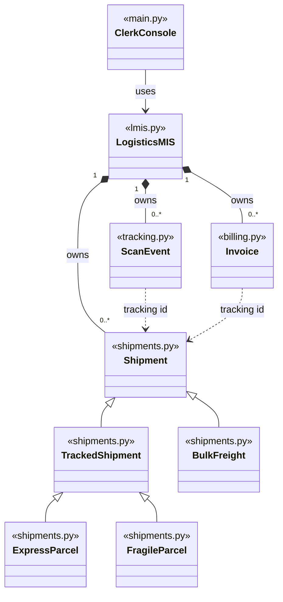

# Programming Assignment 2: Logistics Management Information System

**Group AndrewIDs:** iizanyib, ualijuni, lirumvak

| Member | Name | AndrewID |
| --- | --- | --- |
| 1 | Yvette Izanyibuka | `iizanyib` |
| 2 | Uwimana Ali Junior | `ualijuni` |
| 3 | Lion Irumva Kageruka | `lirumvak` |

## Overview

This system runs the depot operations of SwiftLink Logistics, the courier
company from Assignment 1. It keeps consignment records, tracks each shipment
through the depot network, works out what each customer owes, and reports on
all of it.

What it does:

- **Consignment management.** Add, look up, update and remove shipments. A
  duplicate tracking id raises `DuplicateTrackingIDError`, and an unknown one
  raises `ShipmentNotFoundError`.
- **Journey tracking.** Record scans, show one shipment's scan history in
  time order, list the scans across the network for a given day, calculate
  transit time, and check every express parcel against its delivery
  guarantee.
- **Invoicing.** Raise an invoice for one shipment, or for every shipment
  that has none, and show it broken down by component.
- **Persistence.** Save and load shipments, scan events, invoices and billing
  policy as JSON, and write one waybill text file per shipment.
- **Interface.** A menu for the depot clerk, and a demonstration script.

The four reports are the consignment register, the scan summary, the revenue
summary for a month, and the guarantee compliance report for express parcels.

**Assignment 1 reused.** The five classes (`Shipment`, `TrackedShipment`,
`ExpressParcel`, `FragileParcel`, `BulkFreight`) keep the same three-level
hierarchy and the same pricing rules. We improved them in four ways:

- `ExpressParcel` and `FragileParcel` now take `current_status` before their
  own fields, which is the order the assignment's test example uses.
- Setters refuse text, booleans, NaN and infinity. Names and the destination
  cannot be blank, and a pallet count must be a whole number.
- Each class lists its editable fields, and `update_details()` applies a set
  of changes through the setters, or none of them if one value is refused.
- The Assignment 1 file functions (`save_consignment`, `load_consignment`,
  `write_manifest`) were replaced by `LogisticsMIS.save()`, `load()` and the
  waybills, so persistence lives in one place and no class reports an error
  by printing.

## Project Structure

| File or folder | Contents |
| --- | --- |
| `shipments.py` | The Assignment 1 shipment hierarchy, reused and improved. |
| `tracking.py` | The `ScanEvent` class: one scan of one shipment. |
| `billing.py` | The `Invoice` class and every billing and tax rate. |
| `lmis.py` | The `LogisticsMIS` class, which ties the system together, and the custom exceptions. |
| `main.py` | The driver: the menu interface and the demonstration. |
| `test_lmis.py` | The `unittest` suite. |
| `README.md` | This file. |
| `data/lmis_data.json` | The saved state the system produces. |
| `waybills/` | One waybill per shipment, named `TRACKING_ID.txt`. |

## How to Run

The system needs Python 3.8 or newer and uses only the standard library. We
tested it with Python 3.14 on Windows 11. On Windows, `py` can be used in
place of `python`.

Run the demonstration:

```
python main.py --demo
```

It builds the six shipments of the assignment's worked examples and shows
every feature without any typing. It saves the state to
`data/lmis_data.json`, writes six waybills into `waybills/`, reloads the
saved state and confirms that the revenue total is unchanged.

Run the interactive menu:

```
python main.py
```

It loads `data/lmis_data.json` at start. If the file is missing or damaged,
it says so and starts with an empty system. The menu options are:

| Options | Area |
| --- | --- |
| 1 to 4 | Register, look up, update and remove a shipment |
| 5 to 8 | Record a scan, scan history, network scans for a day, transit time |
| 9 to 11 | Raise an invoice, raise all outstanding invoices, show an invoice |
| 12 to 15 | Consignment register, scan summary, revenue for a month, guarantee compliance |
| 16 to 20 | Save, load, write all waybills, billing policy, load the sample data |
| 0 | Exit |

Changes stay in memory until option 16 saves them to the JSON file. Exiting
with unsaved changes offers to save them. Option 18 writes the waybill files.
Typing `q` at any prompt cancels the current operation.

## Billing and Taxation Rules

**Transport charge.** The invoice takes the transport charge from the
shipment's own `calculate_cost()` and never recomputes it. The assignment has
no distance charge and no express multiplier; the charge depends on the
class of shipment, as in Assignment 1:

| Class | Transport charge (RWF) |
| --- | --- |
| `Shipment` | weight_kg x base_rate_per_kg |
| `TrackedShipment` | base charge + insurance_rate x declared_value (the rate is between 0 and 0.05) |
| `ExpressParcel` | tracked charge + priority fee: 20,000 for 6 h, 12,000 for 12 h, 6,000 for 24 h, 3,000 for 48 h |
| `FragileParcel` | tracked charge + 15% of (weight_kg x base_rate_per_kg) + packaging fee |
| `BulkFreight` | the greater of weight_kg x base_rate_per_kg and volume_m3 x 25,000, plus 2,000 per pallet |

**Invoice.** Every rate is a class variable of `Invoice` in `billing.py`
(lines 95 to 98):

| Component | Rule | Defined in |
| --- | --- | --- |
| Transport charge | `shipment.calculate_cost()` | `Invoice.for_shipment()`; each `calculate_cost()` in `shipments.py` |
| Fuel levy | 6% of the transport charge | `Invoice.FUEL_LEVY_RATE` |
| Remote area surcharge | A flat 8,000 RWF when the destination is a remote district | `Invoice.REMOTE_AREA_SURCHARGE` |
| Corporate discount | 10% of the transport charge for a corporate account | `Invoice.CORPORATE_DISCOUNT_RATE` |
| Subtotal | transport + levy + surcharge - discount | `Invoice.get_subtotal()` |
| VAT | 18% of the subtotal | `Invoice.VAT_RATE` |
| Total payable | subtotal + VAT | `Invoice.get_total()` |

**Taxation.** VAT is 18%, the standard rate in Rwanda, charged on the
subtotal. It therefore applies after the discount, and the fuel levy and the
surcharge are part of the taxed amount. The discount is taken from the
transport charge only. We modelled no charge beyond those in the assignment.

**Rounding.** Each component is rounded to two decimal places, halves
rounding up, using `Decimal` (`round_money()` in `billing.py`). The subtotal
and total are built from the rounded components, so the lines of an invoice
always add up.

**Remote districts and corporate accounts.** These lists are policy, so
`LogisticsMIS` holds them and tells each invoice the two answers when it is
raised. The remote districts are Nyagatare, Rusizi, Kirehe and Nyamasheke
(`LogisticsMIS.DEFAULT_REMOTE_DISTRICTS` in `lmis.py`). Names are matched
without regard to capital letters. The lists can be changed without editing
any class:

1. In the menu, choose option 19 and then save with option 16.
2. Edit the `"policy"` section of `data/lmis_data.json`.
3. In code, pass `remote_districts` and `corporate_accounts` to
   `LogisticsMIS(...)`, or call `add_remote_district()`,
   `remove_remote_district()`, `add_corporate_account()` and
   `remove_corporate_account()`.

A change applies to invoices raised afterwards. An invoice already issued
keeps the terms it was raised with.

**Worked examples.** The demonstration reproduces the assignment's figures:

| ID | Transport | Levy | Remote | Discount | Subtotal | VAT | Total |
| --- | ---: | ---: | ---: | ---: | ---: | ---: | ---: |
| SL-1001 | 6,000.00 | 360.00 | 0.00 | 0.00 | 6,360.00 | 1,144.80 | 7,504.80 |
| SL-2014 | 21,000.00 | 1,260.00 | 0.00 | 2,100.00 | 20,160.00 | 3,628.80 | 23,788.80 |
| SL-3120 | 21,500.00 | 1,290.00 | 0.00 | 2,150.00 | 20,640.00 | 3,715.20 | 24,355.20 |
| SL-4077 | 64,720.00 | 3,883.20 | 0.00 | 6,472.00 | 62,131.20 | 11,183.62 | 73,314.82 |
| SL-5003 | 362,000.00 | 21,720.00 | 8,000.00 | 36,200.00 | 355,520.00 | 63,993.60 | 419,513.60 |
| SL-5004 | 458,000.00 | 27,480.00 | 0.00 | 45,800.00 | 439,680.00 | 79,142.40 | 518,822.40 |

Revenue for the period: 1,067,299.62 RWF.

## Testing

Run the tests with:

```
python -m unittest -v test_lmis.py
```

`test_lmis.py` holds 64 test methods in 9 `TestCase` classes. The most recent
run passed:

```
Ran 64 tests in 0.142s

OK
```

Every class builds its objects in `setUp`. Anything a test writes goes into a
temporary folder that is removed afterwards, so the tests do not depend on
their order or on files left behind.

| Area | What is covered |
| --- | --- |
| Pricing | One test per shipment class, including both branches of the bulk freight rule |
| Validation | Bad values raise `ValueError` and leave the object unchanged |
| Consignment management | Duplicate and unknown ids are refused; updates; removal and what it does to scans and invoices |
| Scan tracking | Scans are returned in time order; transit time; status follows the scans; guarantee verdicts |
| Invoicing | A full breakdown matches the worked example to two decimal places; VAT, remote surcharge and discount |
| Reports | The four reports carry the right figures |
| Persistence | A save and load round trip preserves the revenue total and rebuilds the right classes; one waybill per shipment |
| Failure handling | A missing file, malformed JSON and a damaged record do not crash the system |
| Interface | The menu survives invalid input |


## Design Notes

**Classes and relationships.**

| Module | Class | Role |
| --- | --- | --- |
| `shipments.py` | `Shipment` and four subclasses | What a consignment is and what it costs |
| `tracking.py` | `ScanEvent` | One scan: which shipment, when, where and in what status |
| `billing.py` | `Invoice` | What a customer owes for one shipment |
| `lmis.py` | `LogisticsMIS` | Owns the shipments, scan events, invoices and billing policy |
| `main.py` | `ClerkConsole` | The menu, which catches errors and explains them |

In the class diagram, the label above each class name is the module it
belongs to.



- **Inheritance.** `TrackedShipment` and `BulkFreight` extend `Shipment`.
  `ExpressParcel` and `FragileParcel` extend `TrackedShipment`.
- **Ownership.** `LogisticsMIS` holds the shipments in a dictionary keyed by
  tracking id, a list of scans for each shipment, and at most one invoice for
  each shipment.
- **Association by id.** A `ScanEvent` and an `Invoice` store the tracking id
  and not the shipment object. `LogisticsMIS` is therefore the only owner of
  the records, and a saved file needs no object references.
- **Polymorphism.** `raise_all_invoices()` loops over a mixed collection, and
  each shipment's own `calculate_cost()` supplies its transport charge.

**Status and scans.** The four statuses are received, in transit, out for
delivery and delivered. A shipment's current status is the status of its
latest scan, and a `TrackedShipment`'s `current_status` is updated to match.
Status is therefore not an editable field. The system does not force the
first three statuses into a fixed order, because a shipment may be scanned in
transit at several hubs. A delivery scan closes the journey: there can be
only one, no scan can be dated after it, and it cannot be dated before a scan
already recorded. A scan dated before the delivery is still accepted, since a
handheld may upload late.

**Transit time and guarantees.** Transit time runs from the first scan to the
delivery scan. For a shipment that is not delivered, `get_transit_hours()`
raises `NotDeliveredError` instead of returning a number. The guarantee
report marks each express parcel MET, MISSED or PENDING. An undelivered
parcel whose scans already span more than its guaranteed hours is MISSED.

**Invalid operations.** The classes raise exceptions and do not print error
messages. `main.py` catches each exception by name and tells the user what to
do. No clause catches everything.

| Exception | Raised when |
| --- | --- |
| `ValueError` | A value breaks a rule: a weight, rate, status, timestamp, date, or a field that cannot be edited |
| `DuplicateTrackingIDError` | A tracking id is already registered |
| `ShipmentNotFoundError` | No shipment has that tracking id |
| `DuplicateInvoiceError`, `InvoiceNotFoundError` | A shipment is invoiced twice, or has no invoice yet |
| `NotDeliveredError` | A transit time is asked for before delivery |
| `ScanSequenceError` | A scan would break the order of the journey |
| `PersistenceError` | A data file or waybill cannot be read or written |

The seven custom exceptions derive from `LMISError`. In the menu, letters
typed where a number is expected are asked for again.

**Saving and loading.** `save()` writes one JSON object holding the billing
policy and three lists: shipments, scan events and invoices. Every record
carries a `"type"` key, which `build_shipment()` uses to rebuild the right
subclass. `ScanEvent` and `Invoice` each have `to_dict()` and `from_dict()`.
An invoice saves only its inputs; the levy, discount, VAT and total are
recomputed. `save()` writes to a temporary file and then replaces the old
one, so a failed save cannot damage the last good file. `load()` rebuilds the
whole file before replacing anything, so a missing or malformed file leaves
the system as it was and raises `PersistenceError`. A single damaged record
is skipped and reported.

**Waybills.** `write_all_waybills()` writes `waybills/TRACKING_ID.txt` for
each shipment. A waybill shows the shipment details, the scan history with
the transit time, and the invoice breakdown.

**Removing a shipment.** `remove_shipment()` also removes that shipment's
scan events and invoice. Both refer to the shipment by id, so leaving them
would create records that no lookup can reach, that still count in the
revenue, and that would attach to a later shipment given the same id. The
method returns what it removed, and the menu asks for confirmation first.

**Invoices.** A shipment has at most one invoice. Updating an invoiced
shipment re-issues its invoice under the original date, so an invoice never
disagrees with its shipment. `raise_all_invoices()` leaves existing invoices
alone.

**Additions beyond the assignment.** Each was added to keep a figure correct
or to protect the user's data:

- The delivery rules for scans, which keep transit times meaningful.
- The MISSED verdict for an express parcel that is overdue but not yet
  delivered.
- Re-issuing an invoice when its shipment is updated.
- Saving through a temporary file, and skipping a damaged record with a
  warning instead of refusing the whole file.
- A billing policy option in the menu.

**Assumptions.**

- A destination is compared with the remote district names, so a town inside
  a remote district must be recorded under the district's name.
- Timestamps are local times in the form `YYYY-MM-DD HH:MM`.
- An invoice counts towards the month of its issue date. The demonstration
  issues all six invoices on 2026-09-15.

## Team Contributions

**Yvette Izanyibuka (`iizanyib`)**

- `shipments.py`: the Assignment 1 hierarchy and its improvements, including
  the stricter validation and `update_details()`.
- `tracking.py`: the `ScanEvent` class.
- Journey tracking in `LogisticsMIS`: recording scans, scan history, transit
  time and guarantee compliance.
- `README.md`, with the other two members.

**Uwimana Ali Junior (`ualijuni`)**

- `billing.py`: the `Invoice` class and the billing and tax rules.
- Invoicing in `LogisticsMIS`: raising invoices and the billing policy.
- `lmis.py`: the `LogisticsMIS` class, the custom exceptions and the reports.
- Saving and loading the JSON state, and writing the waybills.
- `README.md`, with the other two members.

**Lion Irumva Kageruka (`lirumvak`)**

- `main.py`: the menu interface and its input handling.
- The demonstration run by `python main.py --demo`.
- `test_lmis.py`: the test suite.
- `README.md`, with the other two members.
