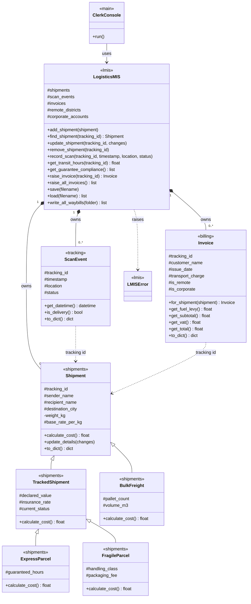
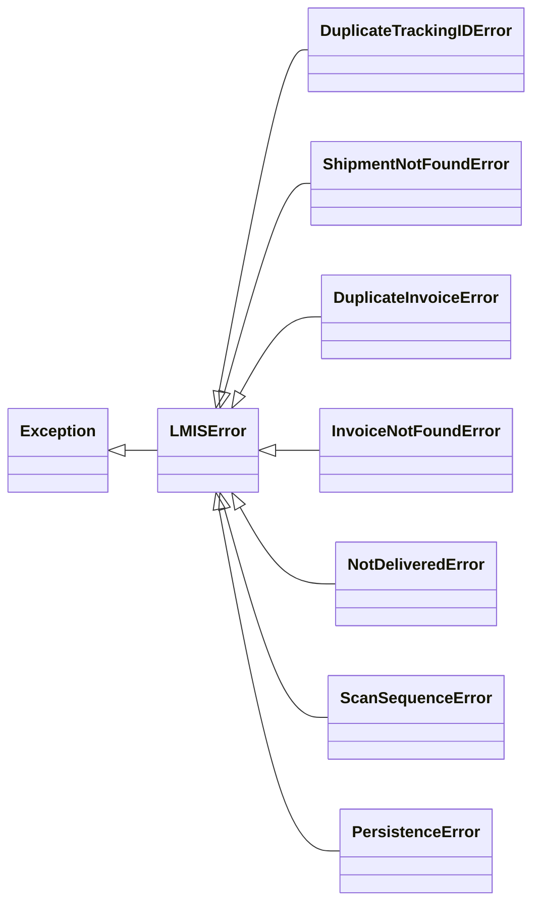
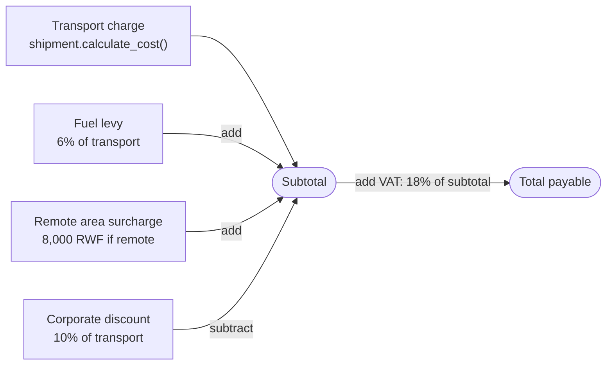

<div align="center">

# Programming Assignment 2: Logistics Management Information System (LMIS) for SwiftLink Logistics

**04-638 A: Programming for Data Analytics, Fall 2026**


</div>

**Group AndrewIDs:** iizanyib, ualijuni, lirumvak

| Member | Name | AndrewID |
| :---: | --- | --- |
| 1 | Yvette Izanyibuka | `iizanyib` |
| 2 | Uwimana Ali Junior | `ualijuni` |
| 3 | Lion Irumva Kageruka | `lirumvak` |

Each member's contribution is stated in the [Contributions](#contributions)
section at the end.

---

## Table of contents

1. [Overview](#overview)
2. [Files](#files)
3. [Requirements](#requirements)
4. [How to run](#how-to-run)
   - [Using the menu](#using-the-menu)
   - [Sample output](#sample-output)
5. [Classes and how they relate](#classes-and-how-they-relate)
   - [Class diagram](#class-diagram)
   - [Exception hierarchy](#exception-hierarchy)
6. [Billing and taxation rules](#billing-and-taxation-rules)
   - [Changing the policy without editing any class](#changing-the-remote-districts-or-corporate-accounts-without-editing-any-class)
   - [Worked examples reproduced](#worked-examples-reproduced)
7. [Design decisions and their justification](#design-decisions-and-their-justification)
8. [Changes to the Assignment 1 code](#changes-to-the-assignment-1-code)
9. [Testing](#testing)
10. [Features beyond the specification](#features-beyond-the-specification)
11. [Assumptions and known limitations](#assumptions-and-known-limitations)
12. [Contributions](#contributions)

---

## Overview

The LMIS runs SwiftLink's depot operations on top of the shipment pricing
hierarchy from Assignment 1.

| | Area | What the system does |
| :---: | --- | --- |
| 📦 | **Consignments** | Register, look up, update and remove shipments. A duplicate tracking id or an unknown one is refused with its own exception. |
| 🚚 | **Journey tracking** | Record scan events, show one shipment's history in time order, list every scan in the network on a given day, work out transit times and check each express parcel against its delivery guarantee. |
| 🧾 | **Invoicing** | Raise an invoice for one shipment, or for all of them at once, with fuel levy, remote-area surcharge, corporate discount and VAT. |
| 📊 | **Reports** | The consignment register, a scan summary, a monthly revenue summary and the guarantee compliance report, each as readable text. |
| 💾 | **Persistence** | Save shipments, scans, invoices and billing policy to `data/lmis_data.json`, load them back into the right classes, and write one waybill per shipment into `waybills/`. |
| 🛡️ | **Graceful failure** | Missing files, malformed JSON, letters typed where a number was expected and unknown ids never stop the program. |

The five Assignment 1 classes are reused and improved but keep their shape.
Three new classes sit beside them: `ScanEvent`, `Invoice` and
`LogisticsMIS`. A menu-driven interface and a demonstration script make up
the driver.

## Files

| File or folder | Contents |
| --- | --- |
| [`shipments.py`](shipments.py) | The Assignment 1 hierarchy (`Shipment`, `TrackedShipment`, `ExpressParcel`, `FragileParcel`, `BulkFreight`), reused and improved |
| [`tracking.py`](tracking.py) | `ScanEvent`: one scan of one shipment |
| [`billing.py`](billing.py) | `Invoice` and every billing and tax rate |
| [`lmis.py`](lmis.py) | `LogisticsMIS`, which ties the system together, and the system's exception classes |
| [`main.py`](main.py) | The driver: the menu interface (`python main.py`) and the demonstration (`python main.py --demo`) |
| [`test_lmis.py`](test_lmis.py) | The `unittest` suite, 64 tests |
| `README.md` | This file |
| `data/lmis_data.json` | The saved state the demonstration produces |
| `waybills/SL-*.txt` | One waybill per shipment, named `TRACKING_ID.txt` |
| `demo_output.txt` | The console output of `python main.py --demo`, included as evidence |

## Requirements

- **Python 3.8 or newer.** We developed and tested on Python 3.14 under
  Windows 11.
- **Nothing needs installing.** The system uses only the standard library
  (`json`, `os`, `datetime`, `math`, `decimal`). The tests also use
  `unittest`, `tempfile`, `shutil`, `subprocess`, `io` and `contextlib`.

## How to run

Open a terminal in the folder that holds the `.py` files.

> [!TIP]
> On Windows, `py` can replace `python` in every command below.

| To do this | Run |
| --- | --- |
| See every feature, without typing anything | `python main.py --demo` |
| Use the menu interface | `python main.py` |
| Run the tests | `python -m unittest test_lmis.py -v` |

**The demonstration** prints the register, scan histories, guarantee
compliance, the six invoices, the revenue summary, updates and removals, the
persistence round trip and a series of handled errors. It also rewrites
`data/lmis_data.json` and the six waybills.

```bash
python main.py --demo
```

**The menu interface** for a depot clerk starts by loading
`data/lmis_data.json`. If that file is missing or damaged, it says so and
starts with an empty system.

```bash
python main.py
```

**The tests** are described in [Testing](#testing).

```bash
python -m unittest test_lmis.py -v
```

The data file and waybill folder are always placed next to `main.py`, so the
commands work from any working directory.

### Using the menu

```text
==========================================================================
 SwiftLink Logistics MIS | 6 shipments, 15 scan events, 6 invoices
 all changes saved
==========================================================================
 CONSIGNMENTS                          REPORTS
   1  Register a shipment               12  Consignment register
   2  Look up a shipment                13  Scan summary
   3  Update a shipment                 14  Revenue summary for a month
   4  Remove a shipment                 15  Guarantee compliance
 JOURNEY TRACKING                      DATA AND SETTINGS
   5  Record a scan                     16  Save the system
   6  Scan history of a shipment        17  Load the saved system
   7  Network scans for a day           18  Write all waybills
   8  Transit time of a shipment        19  Billing policy
 INVOICING                              20  Load the sample data
   9  Raise an invoice                   0  Exit
  10  Raise all outstanding invoices
  11  Show an invoice
==========================================================================
```

| Convenience | How it works |
| --- | --- |
| **Cancel** | Type `q` at any prompt to cancel the current operation. Nothing is changed. |
| **Defaults** | Prompts in square brackets have a default. Pressing Enter at `Timestamp [2026-09-30 18:38]` records the scan at the current time. |
| **Forgiving input** | Tracking ids may be typed in lower case, and amounts may include thousands separators (`1,500`). |
| **Fixed lists** | A status, a guarantee or a handling class can be typed as its number or its name. |
| **Unsaved changes** | The status line shows when there are unsaved changes, and exiting offers to save them. |
| **Sample data** | Option 20 loads the six worked-example shipments with their scans and September 2026 invoices, which is useful for exploring a fresh system. |

### Sample output

These excerpts come from `python main.py --demo`. The full output is in
`demo_output.txt`.

<details>
<summary><b>Consignment register</b></summary>

```text
Consignment register (6 shipments)
  ID       Service          Destination  Status              Charge (RWF)
  SL-1001  Shipment         Kigali       received                6,000.00
  SL-2014  TrackedShipment  Musanze      in transit             21,000.00
  SL-3120  ExpressParcel    Huye         delivered              21,500.00
  SL-4077  FragileParcel    Rubavu       out for delivery       64,720.00
  SL-5003  BulkFreight      Nyagatare    in transit            362,000.00
  SL-5004  BulkFreight      Muhanga      delivered             458,000.00
  -----------------------------------------------------------------------
  Total transport charges                                      933,220.00
```

</details>

<details>
<summary><b>Scan history, transit time and guarantee compliance</b></summary>

```text
Scan history for SL-3120 (ExpressParcel to Huye)
  2026-09-14 08:30  Kigali Depot      received
  2026-09-14 12:05  Muhanga Hub       in transit
  2026-09-14 16:40  Huye Depot        out for delivery
  2026-09-14 18:15  Huye              delivered
  Transit time: 9.75 hours

Guarantee compliance (express parcels)
  SL-3120  guaranteed 12 h   actual 9.75 h                   MET
  Totals: 1 met, 0 missed, 0 pending
```

</details>

<details>
<summary><b>An invoice and the monthly revenue summary</b></summary>

```text
Invoice INV-3120 for SL-3120
  Billed to Uwera Trading, issued 2026-09-15
  Transport charge                         21,500.00
  Fuel levy (6%)                            1,290.00
  Remote area surcharge                         0.00
  Corporate discount (10%)                 -2,150.00
  --------------------------------------------------
  Subtotal                                 20,640.00
  VAT (18%)                                 3,715.20
  Total payable (RWF)                      24,355.20

Revenue summary, September 2026 (6 invoices)
  Transport charges                       933,220.00
  Fuel levy (6%)                           55,993.20
  Remote area surcharges                    8,000.00
  Corporate discounts (10%)               -92,722.00
  --------------------------------------------------
  Subtotal                                904,491.20
  VAT (18%)                               162,808.42
  Total revenue (RWF)                   1,067,299.62
```

</details>

<details>
<summary><b>Errors handled without stopping the program</b></summary>

```text
  Rejected: SL-3120 is already registered
  Rejected: no shipment with tracking id SL-9999
  Rejected: '14/09/2026' is not a valid timestamp, expected YYYY-MM-DD HH:MM
  Rejected: a scan status must be received, in transit, out for delivery or delivered, got 'lost'
  Rejected scan: no shipment with tracking id SL-9999
  Rejected: SL-3120 was delivered at 2026-09-14 18:15, so its journey is closed and cannot take a later scan
  Not available: SL-2014 has not been delivered yet (last scan: in transit at Musanze Hub, 2026-09-14 13:20), so it has no transit time
  Rejected: SL-3120 was already invoiced as INV-3120 on 2026-09-15
  Rejected: a guarantee must be 6, 12, 24 or 48 hours, got 36
  Rejected: 'September 2026' is not a valid month, expected YYYY-MM
  Rejected typed input: '12kg' is not a number such as 2.5
  Load refused (missing file): no saved data file was found at no_such_file.json
  Load refused (malformed file): malformed.json is not valid JSON (Expecting property name enclosed in double quotes at line 1, column 38)
  The system carried on unchanged: 6 shipments, 15 scan events, 6 invoices
```

</details>

## Classes and how they relate

| Module | Class | Responsibility |
| --- | --- | --- |
| [`shipments.py`](shipments.py) | `Shipment` and four subclasses | What a consignment is and what it costs (`calculate_cost()`) |
| [`tracking.py`](tracking.py) | `ScanEvent` | One scan: which shipment, when, where, what status |
| [`billing.py`](billing.py) | `Invoice` | What a customer owes for one shipment, component by component |
| [`lmis.py`](lmis.py) | `LogisticsMIS` | Owns every record and billing policy; every operation a clerk needs |
| [`lmis.py`](lmis.py) | `LMISError` and seven subclasses | Named failures a caller can react to individually |
| [`main.py`](main.py) | `ClerkConsole` | The menu interface; catches exceptions and explains them to the user |

`LogisticsMIS` owns the data. A `ScanEvent` and an `Invoice` refer to their
shipment **by tracking id**, never by holding the shipment object. That is
why the id must be unique (`add_shipment` enforces it) and unchangeable (it
has no setter). An `Invoice` looks at its shipment exactly once, when it is
raised: `Invoice.for_shipment(shipment, ...)` calls
`shipment.calculate_cost()`, so each class's own pricing rule supplies the
transport charge.

### Class diagram

The label above each class name is the module it lives in. `#` marks a
protected attribute, `-` a private one and `+` a public method. A hollow
arrow is inheritance, a filled diamond is ownership and a dashed arrow is a
reference by tracking id.



`TrackedShipment`, `ExpressParcel` and `FragileParcel` **extend**
`calculate_cost()` through `super()`. `BulkFreight` **replaces** it, because
bulk freight is priced on the greater of weight and volume.

<details>
<summary>Plain-text version of the class diagram</summary>

Module map and associations (`◆──` is ownership, `···>` is a reference by
tracking id, `──▷` is inheritance):

```text
 main.py      ClerkConsole ─────────uses──────────┐       run_demo() ──uses──┐
                                                  ▼                          ▼
 lmis.py      LogisticsMIS
                ◆── owns 0..*  ─────────────────────▶ Shipment   (shipments.py)
                ◆── owns 0..* per shipment ─────────▶ ScanEvent  (tracking.py)
                ◆── owns 0..1 per shipment ─────────▶ Invoice    (billing.py)
                └── raises LMISError subclasses (see below)

 tracking.py  ScanEvent ···· tracking_id ····▶ Shipment
 billing.py   Invoice   ···· tracking_id ····▶ Shipment
              Invoice.for_shipment(s) reads s.calculate_cost() once, when raised
```

The Assignment 1 hierarchy in `shipments.py`, unchanged in shape:

```text
                                  Shipment
                 _tracking_id, _sender_name, _recipient_name,
                 _destination_city, __weight_kg (private), _base_rate_per_kg
                 company_name, shipment_count, EDITABLE_FIELDS
                 calculate_cost(), update_details(), __str__(), to_dict()
                                     △
                     ┌───────────────┴────────────────┐
              TrackedShipment                     BulkFreight
     _declared_value, _insurance_rate,       _pallet_count, _volume_m3
     _current_status                         VOLUMETRIC_RATE_PER_M3,
     ALLOWED_STATUSES                        PALLET_HANDLING_FEE
                     △                       calculate_cost() REPLACES
          ┌──────────┴───────────┐
    ExpressParcel           FragileParcel
    _guaranteed_hours       _handling_class, _packaging_fee
    PRIORITY_FEES           HANDLING_SURCHARGE_RATE
    calculate_cost()        calculate_cost()
    EXTENDS                 EXTENDS
```

The new classes:

```text
 ScanEvent (tracking.py)          Invoice (billing.py)             LogisticsMIS (lmis.py)
  _tracking_id                     _tracking_id, _customer_name     _shipments, _scan_events,
  _timestamp  "YYYY-MM-DD HH:MM"   _issue_date "YYYY-MM-DD"         _invoices, _remote_districts,
  _location, _status               _transport_charge                _corporate_accounts
  get_datetime(), get_date()       _is_remote, _is_corporate        add/find/update/remove_shipment
  is_delivery(), format_line()     FUEL_LEVY_RATE, VAT_RATE, ...    record_scan, get_transit_hours
  to_dict(), from_dict()           get_fuel_levy() ... get_total()  get_guarantee_compliance
                                   for_shipment(), to_dict(),       raise_invoice, raise_all_invoices
                                   from_dict()                      format_* reports, save, load,
                                                                    write_all_waybills
```

</details>

### Exception hierarchy

All seven system exceptions are defined in [`lmis.py`](lmis.py#L69) and
derive from `LMISError`.



| Exception | Raised when |
| --- | --- |
| `DuplicateTrackingIDError` | A tracking id is already registered |
| `ShipmentNotFoundError` | No shipment has that tracking id |
| `DuplicateInvoiceError` | The shipment is already invoiced |
| `InvoiceNotFoundError` | The shipment has no invoice yet |
| `NotDeliveredError` | A transit time is asked for before delivery |
| `ScanSequenceError` | A scan would break the journey's order |
| `PersistenceError` | A data file or waybill cannot be read or written |

## Billing and taxation rules

Every rate lives in one place, as class variables of `Invoice` in
[`billing.py`](billing.py#L95). They are company policy and law, the same
for every invoice, so they belong to the class and not to each object.



| Component | Rule | Where in the code |
| --- | --- | --- |
| Transport charge | Whatever the shipment's `calculate_cost()` returns; the invoice never recomputes it | `Invoice.for_shipment()`, [`billing.py` line 147](billing.py#L147); pricing rules in each `calculate_cost()` in [`shipments.py`](shipments.py) |
| Fuel levy | 6% of the transport charge | `Invoice.FUEL_LEVY_RATE = 0.06` ([line 95](billing.py#L95)), `get_fuel_levy()` ([line 280](billing.py#L280)) |
| Remote area surcharge | Flat 8,000 RWF when the destination is a remote district | `Invoice.REMOTE_AREA_SURCHARGE = 8000` ([line 96](billing.py#L96)), `get_remote_surcharge()` ([line 288](billing.py#L288)) |
| Corporate discount | 10% of the transport charge for a registered corporate account | `Invoice.CORPORATE_DISCOUNT_RATE = 0.10` ([line 97](billing.py#L97)), `get_corporate_discount()` ([line 298](billing.py#L298)) |
| Subtotal | transport + levy + surcharge - discount | `get_subtotal()` ([line 309](billing.py#L309)) |
| VAT | 18% of the subtotal | `Invoice.VAT_RATE = 0.18` ([line 98](billing.py#L98)), `get_vat()` ([line 321](billing.py#L321)) |
| Total payable | subtotal + VAT | `get_total()` ([line 330](billing.py#L330)) |

**Taxation.** VAT is charged at 18%, Rwanda's standard rate, on the
subtotal. It therefore applies **after** the corporate discount, and the fuel
levy and remote surcharge are part of the taxable amount. The discount is
10% of the transport charge only; it does not reduce the levy.

**Rounding.** Money is rounded to the cent, halves rounding up, one component
at a time. The subtotal is the sum of the rounded components, and the total
is the rounded subtotal plus the rounded VAT, so the lines of every invoice
add up exactly as printed. The arithmetic is done in `Decimal`
(`to_decimal()` and `round_money()`, `billing.py` lines
[34](billing.py#L34) and [50](billing.py#L50)) rather than in binary floats.
SL-4077's VAT is exactly 11,183.616 RWF, and float noise could otherwise tip
a half-cent the wrong way.

**Other charges.** We modelled no charge beyond those in the specification.

**Who decides "remote" and "corporate".** Those lists are policy, not
properties of a shipment, so `LogisticsMIS` holds them and supplies the two
answers to each invoice as it is raised (`LogisticsMIS._build_invoice()`,
[`lmis.py` line 615](lmis.py#L615)). The default remote districts are
Nyagatare, Rusizi, Kirehe and Nyamasheke
(`LogisticsMIS.DEFAULT_REMOTE_DISTRICTS`, [line 151](lmis.py#L151)).
Matching ignores capitals and surrounding spaces. The invoice records the
two yes-or-no answers, so a later change of policy never silently rewrites
an invoice that has already been issued.

### Changing the remote districts or corporate accounts without editing any class

Any of the three routes below works. None touches a class.

1. **In the menu:** choose `19 Billing policy`, then add or remove a remote
   district or corporate account, and save with `16`.
2. **In the data file:** edit the `"policy"` section of
   `data/lmis_data.json`, then start the program or choose `17`:
   ```json
   "policy": {
       "remote_districts": ["Kirehe", "Nyagatare", "Nyamasheke", "Rusizi"],
       "corporate_accounts": ["Gasabo Pharmacy", "Lake Glassworks", "..."]
   }
   ```
3. **From code:** pass the lists to the constructor, or call the four policy
   methods:
   ```python
   system = LogisticsMIS(remote_districts=["Rusizi", "Kirehe"],
                         corporate_accounts=["Uwera Trading"])
   system.add_remote_district("Nyagatare")
   system.remove_corporate_account("Uwera Trading")
   ```

> [!NOTE]
> New rules apply to invoices raised from then on. To apply them to an
> existing invoice, re-issue it: menu option 9 offers this, or call
> `raise_invoice(tracking_id, reissue=True)`.

### Worked examples reproduced

`python main.py --demo` prints these figures, which match the specification
to the cent. All amounts are in RWF.

| ID | Transport | Levy | Remote | Discount | Subtotal | VAT | TOTAL |
| --- | ---: | ---: | ---: | ---: | ---: | ---: | ---: |
| SL-1001 | 6,000.00 | 360.00 | 0.00 | 0.00 | 6,360.00 | 1,144.80 | **7,504.80** |
| SL-2014 | 21,000.00 | 1,260.00 | 0.00 | 2,100.00 | 20,160.00 | 3,628.80 | **23,788.80** |
| SL-3120 | 21,500.00 | 1,290.00 | 0.00 | 2,150.00 | 20,640.00 | 3,715.20 | **24,355.20** |
| SL-4077 | 64,720.00 | 3,883.20 | 0.00 | 6,472.00 | 62,131.20 | 11,183.62 | **73,314.82** |
| SL-5003 | 362,000.00 | 21,720.00 | 8,000.00 | 36,200.00 | 355,520.00 | 63,993.60 | **419,513.60** |
| SL-5004 | 458,000.00 | 27,480.00 | 0.00 | 45,800.00 | 439,680.00 | 79,142.40 | **518,822.40** |

**Revenue for the period: 1,067,299.62**

SL-1001 is sent by a private individual, so it takes no discount. SL-5003
is the only consignment going to a remote district (Nyagatare). Every other
sender is a corporate account.

## Design decisions and their justification

### Records refer to shipments by id

`ScanEvent` and `Invoice` hold a tracking id, not a shipment object. As a
result, `LogisticsMIS` is the only owner of every record, a saved file needs
no object references, and a scan or invoice read back from JSON reattaches
to its shipment by a simple dictionary lookup.

### Lookups raise and never return `None`

`find_shipment()` raises `ShipmentNotFoundError`, as the specification
requires. `get_invoice()` raises `InvoiceNotFoundError` for a shipment that
exists but has not been invoiced, so a caller can tell "wrong id" from "not
yet invoiced". `get_latest_scan()` does return `None` for a shipment with no
scans, because there "no scan yet" is a normal answer rather than a failed
lookup.

### Removing a shipment removes its scans and its invoice

A scan or an invoice only means something through the shipment it refers
to. Leaving them behind would create orphan records that no lookup can
reach. They would still count in the monthly revenue, and they would attach
themselves to any future shipment registered under the same id. So
`remove_shipment()` cascades. It returns the removed shipment, scans and
invoice, so the caller can show or archive them. Because removal also
removes revenue, the menu asks for confirmation and warns when the shipment
has been invoiced. A test checks that the id can then be reused with a clean
history.

### Status comes from the scans

A shipment's current status and location are those of its latest scan. For
a `TrackedShipment`, recording a scan also moves `current_status` on through
its Assignment 1 setter, which is what that attribute was for.
`current_status` is therefore **not** an editable field in
`update_shipment()`: a status typed by hand would contradict the journey the
scans record. Every shipment class can be scanned, because the depot scans
everything it handles. A plain `Shipment` or `BulkFreight` with no scans
reports "not scanned yet".

### A delivery scan closes the journey

`add_scan_event()` refuses, with `ScanSequenceError`:

- a second delivery scan,
- any scan dated after the delivery, and
- a delivery dated before a scan already recorded.

Without these rules the transit time could be negative or meaningless. A
scan dated *before* the delivery is still accepted, because a handheld that
was offline may upload late. Scans are kept sorted by time, and the sort is
stable, so two scans in the same minute keep the order in which they were
recorded.

### Transit time is never a misleading number

`get_transit_hours()` runs from the first scan to the delivery scan. If
there is no delivery scan it raises `NotDeliveredError`, whose message gives
the last known status and place, instead of returning 0, `None` or the time
so far. The guarantee report gives one of three verdicts:

| Verdict | Meaning |
| --- | --- |
| **MET** | Delivered within `guaranteed_hours` |
| **MISSED** | Delivered late, *or* still undelivered with more time already elapsed than the guarantee allowed; waiting cannot rescue such a parcel |
| **PENDING** | Not delivered yet, and still in time |

### One invoice per shipment, and it stays in step with the shipment

When an invoiced shipment is updated, `update_shipment()` re-issues its
invoice under the original issue date. The system therefore never holds an
invoice that disagrees with the shipment it bills, and the revenue stays in
the right month. Raising a second invoice by mistake is refused with
`DuplicateInvoiceError` unless `reissue=True` is passed.
`raise_all_invoices()` invoices every shipment that does not have an invoice
yet. It leaves existing invoices alone, so running it again in October
cannot move September's revenue into October. An invoice has getters but no
setters, because it is an issued document.

### Invoices store inputs, not results

In the spirit of Assignment 1, where the priority fee was derived and not
stored, an invoice saves only what cannot be recomputed: the id, customer,
issue date, transport charge and the two policy answers. The levy,
discount, subtotal, VAT and total are derived when asked for. The revenue
round trip therefore genuinely recomputes every figure. The demonstration
and a test go further: they re-price the reloaded shipments from scratch and
still reach 1,067,299.62.

### Updates are all or nothing, and go through the setters

Each class declares an `EDITABLE_FIELDS` table (field name and value type),
and each subclass extends its parent's table. `Shipment.update_details()`
applies the changes through the Assignment 1 setters, so every validation
rule still runs. If any value is refused, the changes already applied are
rolled back before the error is passed on. The tracking id is left out of
every table: it is the shipment's identity. The value types let the menu
convert what the clerk types before the setter sees it.

### The classes raise and the driver handles

No class prints anything. Each raises a specific exception whose message
says what was wrong and what was received. `main.py` catches each exception
**by name** and adds what the user should do about it:

| Situation | Raised by | Exception | What the user is told (`main.py`) |
| --- | --- | --- | --- |
| Duplicate tracking id | `LogisticsMIS.add_shipment` | `DuplicateTrackingIDError` | Use another id, or look the shipment up (option 2) |
| Unknown tracking id | `find_shipment` and every method that looks one up | `ShipmentNotFoundError` | Check the id, or list every shipment (option 12) |
| Bad value (weight, rate, status, timestamp, date, month, field name) | the setters, `ScanEvent`, `Invoice` | `ValueError` | What was wrong; nothing was changed |
| Scan out of order | `add_scan_event` | `ScanSequenceError` | Check the timestamp and status |
| Transit time before delivery | `get_transit_hours` | `NotDeliveredError` | Record a delivered scan when it arrives (option 5) |
| Invoice raised twice / not yet raised | `raise_invoice` / `get_invoice` | `DuplicateInvoiceError` / `InvoiceNotFoundError` | Show it (option 11) / raise it (option 9) |
| Missing, unreadable or malformed file | `save`, `load`, `write_waybill` | `PersistenceError` | Check the file; the data in memory is unchanged |
| Letters typed for a number | `parse_number` in `main.py` | `ValueError` | Asked again, with an example of what to type |
| Ctrl+C during an operation, or input ending | the keyboard | `KeyboardInterrupt`, `EOFError` | Back to the menu, or a clean exit with a warning about unsaved changes |

No `except` clause catches everything, so a genuine programming error is
never hidden behind a friendly message. Deriving all seven system
exceptions from `LMISError` lets a caller catch the whole family with one
clause when that is what it wants, and the menu does so as a last safety
net after the specific clauses.

### Persistence

`data/lmis_data.json` holds one object with a format version, the billing
policy, and three lists: `shipments`, `scan_events` and `invoices`. Every
record carries its `"type"` key. Shipments go through the Assignment 1
`build_shipment()`, which rebuilds the right subclass. `ScanEvent` and
`Invoice` each have a `to_dict()` and a `from_dict()` that check their own
type key. Three safeguards apply:

| Safeguard | What it means |
| --- | --- |
| **Saving is atomic** | The data is written to a temporary file and moved into place in one step (`os.replace`), so a failure part-way through never destroys the last good save. |
| **Loading is all or nothing for the file** | A missing file, invalid JSON, a file that is not text, or JSON of the wrong shape raises `PersistenceError`. The system in memory is left exactly as it was, because nothing is replaced until the whole file has been rebuilt. |
| **One damaged record costs only itself** | It is skipped with a warning that `load()` returns, together with any scans or invoices that referred to it. Losing a whole day's data because of one bad line would be a harsh trade, and the driver shows every warning. |

### Waybills

`write_all_waybills()` writes `waybills/TRACKING_ID.txt` for every shipment.
Each waybill shows the shipment details, taken from the polymorphic
`__str__` of Assignment 1 so each class shows its own fields, the transport
charge, the current status, the full scan history with the transit time,
and the invoice breakdown.

### Encapsulation and polymorphism

Every new attribute is protected (a single underscore) and reached through
getters. Policy lists are handed out as copies. Polymorphism does the work
in three places:

- **Invoicing a mixed collection.** `raise_all_invoices()` and
  `Invoice.for_shipment()` let each shipment's own `calculate_cost()` price
  it.
- **The register.** The same call prices every row.
- **The waybills.** One `str(shipment)` call shows the right details for
  every class.

## Changes to the Assignment 1 code

The hierarchy is unchanged in shape: the same five classes on three levels,
the same pricing rules (three subclasses extend `calculate_cost()` through
`super()` and `BulkFreight` replaces it), and the same protected attributes
and private `__weight_kg` with its name mangling. The class variables,
`__str__` and `to_dict()` chains and `"type"` key are also as they were.
What changed, and why:

1. **Constructor order of `ExpressParcel` and `FragileParcel`.** Both now take
   the parent's parameters first, including `current_status`, and then their
   own:
   ```python
   ExpressParcel(..., declared_value, insurance_rate, current_status, guaranteed_hours)
   ```
   The Assignment 2 specification's own `unittest` example builds an
   `ExpressParcel` in this order, and it failed with our old order. That
   example is now a test in our suite.
2. **Numbers are checked before they are compared.** `validate_number()`
   refuses text, booleans, NaN and infinity. Previously `float("nan")`, which
   a user can type, passed every range check, and text raised a `TypeError`
   rather than a `ValueError`.
3. **Names and destination may not be blank** (`validate_text()`). In
   Assignment 1 these were stored as given, but now the destination decides
   the remote surcharge and the sender decides the corporate discount.
4. **A pallet count must be a whole number**, and a guarantee is stored as an
   `int`. Previously 2.5 pallets were accepted.
5. **New:** `EDITABLE_FIELDS`, `get_editable_fields()` and the all-or-nothing
   `update_details()`, which the LMIS update is built on, and
   `get_service_type()`.
6. **`build_shipment()` passes saved values by keyword** through a
   `SHIPMENT_CLASSES` table, so a change of parameter order, as in item 1,
   can never put a value into the wrong attribute again.
7. **Retired:** `save_consignment()`, `load_consignment()`, `write_manifest()`
   and their helpers. `LogisticsMIS.save()` and `load()` now persist the whole
   system, not just the shipments, and waybills replace the manifest. Keeping
   both would have duplicated the persistence logic. It would also have left
   `print` calls inside the model module, which breaks the rule that classes
   raise and callers handle.
8. **Sample data:** SL-1001's sender is now a private individual, to match the
   worked examples.

## Testing

### How to run

```bash
python -m unittest test_lmis.py -v
```

### What the tests cover

[`test_lmis.py`](test_lmis.py) holds **64 test methods in 9 `TestCase`
classes**. Every class builds its objects in `setUp`. Everything written to
disk goes into a temporary folder created in `setUp` and deleted afterwards
(`addCleanup`), so no test depends on another test, on the order in which
tests run, or on a file left behind.

| Test class | Tests | Area of section 5 | In short |
| --- | :---: | --- | --- |
| `TestPricing` | 7 | Pricing | One test per shipment class, including both bulk freight branches |
| `TestValidation` | 9 | Validation | Bad values raise `ValueError` and leave the object unchanged |
| `TestConsignmentManagement` | 9 | Consignment management | Duplicate and unknown ids refused; updates and removal |
| `TestScanTracking` | 9 | Scan tracking | Scans returned in order; transit time; journey rules; guarantee verdicts |
| `TestInvoicing` | 10 | Invoicing | Full breakdown matches the worked examples to two decimal places |
| `TestReports` | 4 | Reports | The four reports carry the right figures |
| `TestPersistence` | 5 | Persistence | A save and load round trip preserves the revenue total |
| `TestFailureHandling` | 6 | Failure handling | Missing, malformed and damaged files never crash the system |
| `TestUserInterface` | 5 | Interface (optional feature) | The menu survives bad input |
| **Total** | **64** | | |

<details>
<summary><b>What each test class checks, in detail</b></summary>

**`TestPricing`** (7 tests)

- One test per class.
- Both bulk freight branches assert which charge was greater.
- The fragile surcharge excludes insurance.
- One polymorphic loop totals 933,220.00.

**`TestValidation`** (9 tests)

- `assertRaises(ValueError)` for a 36 h guarantee (the specification's
  example), insurance above 5%, 40, 0 and 2.5 pallets, a malformed id (which
  is not counted), `"abc"`/NaN/`True` as a weight, a blank destination,
  `'14/09/2026'`, the status `'lost'` and an impossible invoice date.
- Each also checks that the object was left unchanged.

**`TestConsignmentManagement`** (9 tests)

- A duplicate id is refused and the original kept.
- An unknown id is refused.
- Updates go through the setters, and a partly bad update changes nothing.
- The id and status cannot be edited.
- An update re-issues the invoice.
- Removal cascades and frees the id.
- Removing an unknown id is refused.

**`TestScanTracking`** (9 tests)

- Scans recorded out of order come back in order.
- Transit time is 9.75 h.
- Unknown ids, and transit time before delivery, are refused.
- Network scans for a day work.
- The journey rules hold, and a late earlier scan is accepted.
- Status follows the scans.
- Guarantee verdicts come out MET, MISSED, PENDING and
  MISSED-while-undelivered.

**`TestInvoicing`** (10 tests)

- SL-3120's **full breakdown matches the worked example to two decimal
  places**, and all six VATs and totals match.
- Revenue is 1,067,299.62.
- The surcharge applies only to the remote district, and the private sender
  gets no discount.
- The transport charge comes from `calculate_cost()`, checked with a test
  double.
- A duplicate invoice is refused and a re-issue works.
- "Raise all" does not move revenue.
- Policy changes need no class edits.
- The printed breakdown is checked.

**`TestReports`** (4 tests)

- Register, scan summary, revenue by component (September and an empty
  October) and the guarantee report.

**`TestPersistence`** (5 tests)

- A **save and load round trip preserves the revenue total**, both from the
  saved invoices and after re-pricing the reloaded shipments.
- The type key rebuilds all five classes.
- Scans, transit time, policy and invoices survive.
- `ScanEvent` and `Invoice` carry and check a type key.
- Exactly one waybill per shipment, with its contents.

**`TestFailureHandling`** (6 tests)

- **Loading a missing file does not crash**: the error is clear, the state
  is intact and the system stays usable.
- Malformed JSON and JSON of the wrong shape are refused.
- A damaged record is skipped with a warning.
- The driver starts empty when the file is missing.
- An unwritable waybill folder raises `PersistenceError`.

**`TestUserInterface`** (5 tests)

- Letters typed for a number cause a re-prompt.
- The menu survives nonsense choices and unknown ids.
- A full registration with a typo on the way ends in a saved file.
- Cancelling with `q` changes nothing.
- Importing the modules runs nothing.

</details>

### Results

All 64 tests pass (Python 3.14.7, Windows 11):

```text
$ python -m unittest test_lmis.py
................................................................
----------------------------------------------------------------------
Ran 64 tests in 0.210s

OK
```

> [!NOTE]
> The tests caught one real defect during development. Calling
> `update_shipment("SL-2014", tracking_id="x")` raised a confusing
> `TypeError`, because the change collided with the method's own
> `tracking_id` parameter. We made that parameter positional-only
> (`def update_shipment(self, tracking_id, /, **changes)`), so the attempt
> now reaches the shipment and is refused with a clear "can not be edited"
> message.

The code also passes `pycodestyle` (PEP 8) and `pyflakes` with no warnings.

## Features beyond the specification

| Feature | Why it is there |
| --- | --- |
| **Scan sequence rules** (`ScanSequenceError`) | They keep transit times meaningful |
| **Guarantee verdicts for undelivered parcels** | A parcel already past its guarantee is reported MISSED at once, rather than PENDING until it arrives |
| **Automatic invoice re-issue** | An invoice is re-issued when an invoiced shipment is corrected; an explicit `reissue=True` is also available |
| **Invoice summary table** | Laid out like the worked examples, with invoice numbers derived from tracking ids (`INV-3120`) |
| **All-or-nothing updates** | A refused value rolls back the changes already applied |
| **Atomic saves, all-or-nothing loads, per-record warnings** | Damaged data never costs more than the damaged record |
| **Billing policy editor** | The menu edits the policy, and the policy is saved with the data |
| **Menu comforts** | Cancel with `q`, defaults in brackets, lower-case ids and `1,500`-style amounts accepted, an unsaved-changes indicator with an offer to save on exit, and a one-step option to load the sample data |
| **Exact money arithmetic** | `Decimal`, with half-up rounding to the cent |

Each feature exists to keep a figure trustworthy or to stop a clerk losing
work. The justifications are in the design decisions above.

## Assumptions and known limitations

- A destination is matched against remote districts by name, ignoring case,
  so a town inside a remote district (for example Kamembe in Rusizi) must
  be recorded under its district name to attract the surcharge.
- Corporate accounts are matched against the sender name, ignoring case.
- Timestamps are local time with no time zone, as the specification's
  `YYYY-MM-DD HH:MM` format implies.
- An invoice's month is the month of its issue date. The demonstration
  issues all six invoices on 2026-09-15. In the menu, the date defaults to
  today.
- `Shipment.shipment_count` counts shipment objects created while the program
  runs, as in Assignment 1, so reloading a file adds to it.
- Removing a shipment does not delete a waybill already written for it.
  Waybills are printed documents, and deleting files is left to the user.

## Contributions

| Part | Written by |
| --- | --- |
| [`shipments.py`](shipments.py): Assignment 1 hierarchy and its improvements | Yvette Izanyibuka (`iizanyib`) |
| [`tracking.py`](tracking.py): `ScanEvent` and journey tracking in `LogisticsMIS` | Yvette Izanyibuka (`iizanyib`) |
| [`billing.py`](billing.py): `Invoice`, billing rules and invoicing in `LogisticsMIS` | Uwimana Ali Junior (`ualijuni`) |
| [`lmis.py`](lmis.py): `LogisticsMIS`, exceptions, reports, persistence, waybills | Uwimana Ali Junior (`ualijuni`) |
| [`main.py`](main.py): menu interface and demonstration | Lion Irumva Kageruka (`lirumvak`) |
| [`test_lmis.py`](test_lmis.py): test suite | Lion Irumva Kageruka (`lirumvak`) |
| `README.md`: documentation | Lion Irumva Kageruka (`lirumvak`), Uwimana Ali Junior (`ualijuni`), Yvette Izanyibuka (`iizanyib`) |

Each member's individual reflection report is submitted separately as a PDF
and is not part of this archive.

<div align="right">

[Back to top](#programming-assignment-2-logistics-management-information-system-lmis-for-swiftlink-logistics)

</div>
